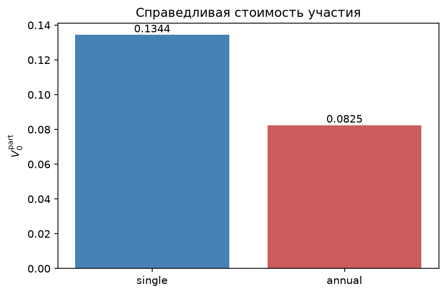
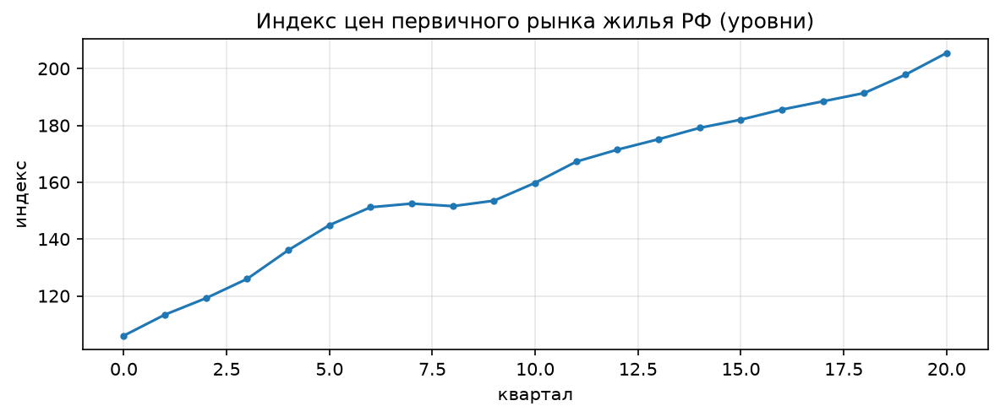
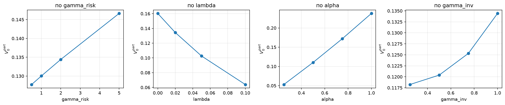
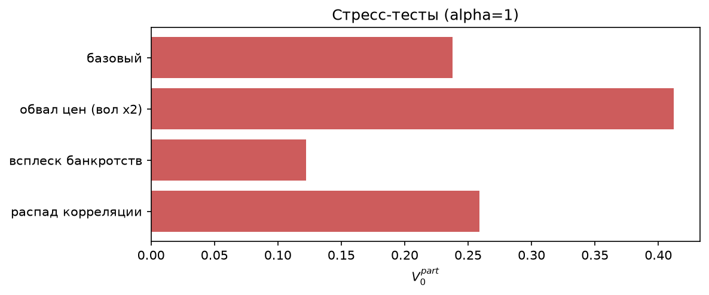
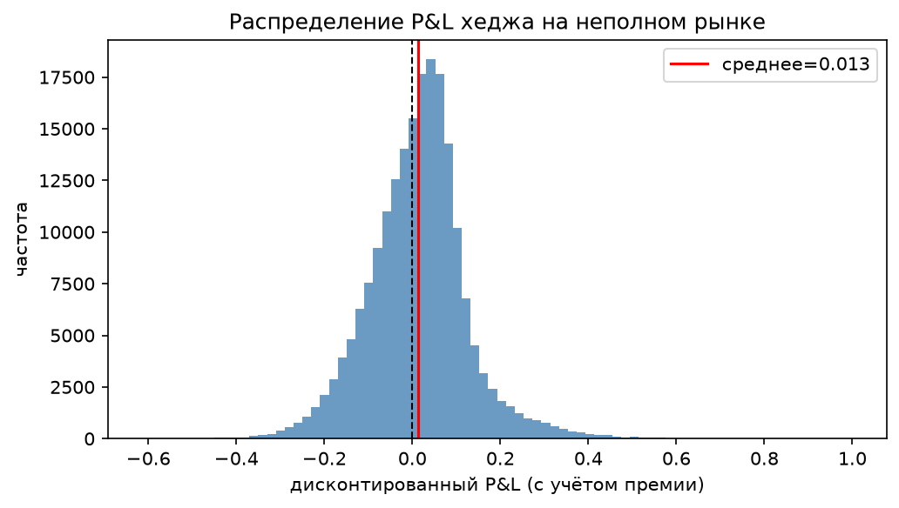

# Справедливая стоимость участия в прибыли: Deep Hedging

Расчёт справедливой стоимости участия в прибыли для паевого договора
страхования жизни с единовременной или ежегодной уплатой премии и стратегией
инвестирования в строящуюся недвижимость.

Базовый актив неторгуем, риски незавершения строительства и смертности
нехеджируемы — рынок неполон, и классическая безарбитражная оценка не даёт
единственной цены. Цена определяется как минимальный капитал, при котором
остаточный риск позиции по энтропийной мере неположителен; оптимальная
стратегия хеджирования аппроксимируется нейронной сетью
([Deep Hedging](https://doi.org/10.1080/14697688.2019.1571683)).

Курсовая работа: [`coursework.pdf`](coursework.pdf). ВМК МГУ, кафедра
исследования операций.

---

## Результаты

### Справедливая стоимость участия

| Режим премии | π(ξ_α) | π(ξ₀) | **V₀ᵖᵃʳᵗ** |
|---|---:|---:|---:|
| единовременная | 0,857 | 0,723 | **0,1344** |
| ежегодная | 0,069 | −0,013 | **0,0825** |



При равной приведённой стоимости взносов единовременная премия даёт более
дорогое участие: весь капитал подвержен динамике актива с момента заключения
договора, тогда как при ежегодной уплате вход в актив усредняется во времени.

Цены — нетто-величины: из выплаты вычтен дисконтированный поток будущих
взносов. Поэтому для ежегодного режима π означает капитал, требуемый **сверх**
будущих взносов, и может быть отрицательным.

### Верификация

| Метод | Цена |
|---|---:|
| Блэк–Шоулз | 0,06396 |
| Монте-Карло | 0,06390 ± 0,00015 |
| **Глубокое хеджирование (полный рынок)** | **0,06405** |

Погрешность 0,14%. На полном рынке обученная стратегия воспроизводит
аналитическое решение — это подтверждает корректность не только симуляции, но
и самого метода оценки.

### Ключевой результат: цена риска незавершения при режиме эскроу

Механизм счетов эскроу (214-ФЗ) возвращает дольщику внесённые средства
полностью. Тем не менее участие в прибыли обесценивается:

| Конфигурация | π(ξ_α) | V₀ᵖᵃʳᵗ |
|---|---:|---:|
| λ = 0 (риска нет) | 0,872 | 0,1603 |
| λ = 0,02, η_R = 1, возврат в момент θ | 0,857 | **0,1344** |
| то же, возврат в момент выплаты | 0,833 | 0,1412 |
| λ = 0,02, η_R = 0,9 | 0,846 | 0,1375 |

**Риск незавершения снижает стоимость участия на 16% при полном возврате
номинала.** Убыток обусловлен не потерей вложенных средств, которая исключена
законом, а утратой права на инвестиционный доход: в неблагоприятном исходе
встроенный опцион пропадает.

Величина и момент возврата почти не влияют на V₀ᵖᵃʳᵗ (расхождение 2–5%): на
путях с незавершением выплата одинакова при α > 0 и α = 0, поэтому в разности
π(ξ_α) − π(ξ₀) эта компонента сокращается. Эффекты эскроу видны в полной цене
обязательства.

### Калибровка на данных Росстата

Оценочные индексы недвижимости занижают волатильность из-за усреднения и
запаздывания оценок. Десглаживание по Гелтнеру:

| Показатель | Значение |
|---|---:|
| коэффициент сглаживания φ | 0,671 |
| наблюдаемая волатильность (год) | 0,0437 |
| десглаженная волатильность (год) | 0,0879 |
| коэффициент повышения | **2,01** |



Использование сырого индекса занизило бы стоимость встроенного опциона кратно.

Смертность — возрастные коэффициенты населения РФ (Росстат, ЕМИСС, оба пола,
2023 г.), пересчитанные по `q = m/(1 + 0,5m)`: ₁₀p₄₀ = 0,9380,
аннуитет дожития 7,8791.

### Чувствительность



| Параметр | Диапазон | V₀ᵖᵃʳᵗ |
|---|---|---|
| неприятие риска γ | 0,5 → 5,0 | 0,128 → 0,147 |
| интенсивность незавершения λ | 0 → 0,10 | 0,160 → 0,064 |
| доля участия α | 0,25 → 1,0 | 0,053 → 0,238 |
| доля фонда в недвижимости γ_inv | 0,25 → 1,0 | 0,118 → 0,134 |

Зависимость от α близка к линейной — эмпирическое подтверждение опционной
декомпозиции выплаты, полученной аналитически.

При малой доле рискового актива стоимость участия не обнуляется: безрисковая
ставка (5%) выше гарантированной (2%), поэтому фонд почти наверняка обгоняет
гарантию, и участие вырождается из опциона в почти детерминированную выплату.

### Стресс-тесты и качество хеджа



Наибольшее влияние даёт удвоение волатильности: стоимость участия растёт в
1,73 раза. Всплеск банкротств (λ = 0,10) снижает её почти вдвое.



На неполном рынке распределение итогового капитала не вырождается в точку
(среднее 0,013, ст. отклонение 0,113, 5%-квантиль −0,171): остаётся разброс,
обусловленный нехеджируемыми рисками, который и оценивается мерой риска.

---

## Что внутри

| модуль | содержание |
|---|---|
| `deep_hedging/config.py` | параметры модели (`Config`), цена бескупонной облигации |
| `deep_hedging/data.py` | индекс цен жилья, десглаживание Гелтнера |
| `deep_hedging/mortality.py` | коэффициенты смертности Росстата, аннуитет дожития |
| `deep_hedging/market.py` | симуляция недвижимости, прокси, ставки Хала–Уайта |
| `deep_hedging/contract.py` | фонд, гарантия, поток взносов, выплата |
| `deep_hedging/pricing.py` | сеть-стратегия, обучение, out-of-sample оценка |
| `deep_hedging/verification.py` | Блэк–Шоулз и Монте-Карло |
| `calculator.ipynb` | воспроизведение численных экспериментов главы 4 |
| `tests/` | проверки корректности (`pytest`) |

## Установка

```bash
git clone https://github.com/LeonteVVA/deep-hedging-unit-linked.git
cd deep-hedging-unit-linked
python -m venv .venv && source .venv/bin/activate   # Windows: .venv\Scripts\activate
pip install -r requirements.txt
```

PyTorch с поддержкой CUDA ставится отдельно — обычный `pip install torch`
даёт CPU-сборку:

```bash
pip install torch --index-url https://download.pytorch.org/whl/cu128
```

Индекс (`cu126`, `cu128`, `cu130`) выбирается под версию драйвера; см.
[pytorch.org](https://pytorch.org/get-started/locally/). Расчёт идёт и на CPU,
но заметно дольше.

## Запуск

```bash
jupyter notebook calculator.ipynb    # все эксперименты и графики
pytest tests/                        # проверки корректности
```

Графики сохраняются в `assets/` автоматически.

Или из кода:

```python
import deep_hedging as dh

cal = dh.calibrate("realty_index.csv")
cfg = dh.Config(sigma=cal.sigma_true)

res = dh.v_part(cfg, mode=dh.SINGLE, return_parts=True)
print(res["V_part"])          # 0.13441

# анализ чувствительности: конфигурация неизменяема
dh.v_part(cfg.with_(lam=0.10), mode=dh.SINGLE)
```

## Метод

1. Симуляция факторов: цена недвижимости со скачком незавершения, торгуемый
   прокси, короткая ставка Хала–Уайта, момент смерти.
2. Формирование фонда, гарантированного уровня и выплаты для обоих режимов
   уплаты премии. Схема участия — терминальный бонус (point-to-point).
3. Обучение нейросетевой стратегии хеджирования минимизацией энтропийной меры
   риска терминального P&L.
4. Оценка цены вне обучающей выборки на независимом наборе траекторий.
5. Справедливая стоимость участия — разность цен договора с участием и без
   него, на общих случайных числах.

## Данные

`realty_index.csv` — индекс цен первичного рынка жилья РФ (Росстат,
квартальные наблюдения). Столбец `price` — уровни цен. При отсутствии файла
модули переключаются на синтетический ряд, о чём сообщается явно.

## Ограничения

Правовой режим долевого строительства (214-ФЗ, счета эскроу) возвращает
дольщику номинал полностью, поэтому в базовом сценарии `eta_R = 1`, а
банкротство отдельного застройщика не обрушивает рыночный индекс, поэтому
`eta_S = 1`.

Калибровка волатильности выполнена по 21 квартальному наблюдению периода
аномального роста рынка жилья (программы льготной ипотеки); оценку следует
считать ориентировочной по порядку величины. Изменение коэффициента
сглаживания φ втрое меняет итоговую оценку в 1,43 раза — анализ устойчивости
приведён в ноутбуке.

Риск незавершения моделируется одним пуассоновским скачком, что соответствует
экспозиции к единственному объекту; для диверсифицированного портфеля риск
частично сглаживается.
